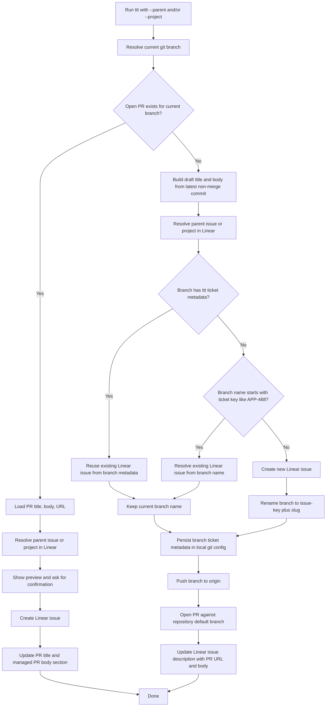

# tickettrain

`ttt` (tickettrain) is a local `babashka` command that:

1. Finds the pull request for the branch you currently have checked out.
2. Reads the PR title and body from GitHub.
3. Resolves either a parent issue or a project in Linear.
4. Asks you to confirm the selection and title.
5. Creates a Linear issue.
6. Updates the GitHub PR body with a link to the new Linear issue.
7. If no PR exists yet, renames the branch, pushes it, and opens the PR.

## Providers

- Forges: **GitHub** via the `gh` CLI and **GitLab** via its REST API.
- Trackers: **Linear**, **GitHub Issues**, and **Jira**.

Select GitHub Issues with `:tracker {:provider :github-issues}` in `config/ttt.edn`.

`ttt` runs inside the target application repo where you want to create the PR and tracker issue.

## Install

One-liner:

```bash
curl -fsSL https://raw.githubusercontent.com/alexkarpandrus/tickettrain/main/bin/install | bash
```

This clones `ttt` into `~/.local/share/tickettrain` and links `ttt` into `~/.local/bin`. From a local checkout, run `./bin/install` instead.

Install the agent skill (Claude Code, Codex, Cursor, and more):

```bash
npx skills add alexkarpandrus/tickettrain
```

The skill ships as `skills/tickettrain/SKILL.md` (portable Anthropic/OpenAI format) and is installed via [skills.sh](https://www.skills.sh/). It works for private repos when GitHub CLI or Git credentials are available.

## Prerequisites

- `git`
- `gh`
- `bb`

If `bb` is not on your `PATH`, the wrapper also checks `~/.local/bin/bb`.

Authenticate GitHub CLI first:

```bash
gh auth login
```

## Configure

Run `ttt setup` to configure Linear interactively — it validates your API key, auto-discovers the workspace, and lets you pick a team:

```bash
ttt setup
```

It writes to `config/ttt.local.edn` (gitignored, `chmod 600`). To configure manually instead, `ttt` loads `.env` first, then the EDN config:

Supported `.env` keys:

- `LINEAR_API_KEY`
- `LINEAR_TEAM_ID`
- `LINEAR_ASSIGNEE_ID`
- `LINEAR_STATE_ID`
- `LINEAR_STATE_NAME`
- `LINEAR_WORKSPACE`
- `LINEAR_WORKSPACE_URL`
- `JIRA_EMAIL` (Atlassian account email)
- `JIRA_API_TOKEN` (scoped Jira API token)
- `JIRA_SITE_URL` (for example, `https://your-site.atlassian.net`)
- `JIRA_CLOUD_ID`
- `JIRA_PROJECT` (project key, for example, `APP`)
- `JIRA_ISSUE_TYPE` (default `Task`)
- `GITLAB_TOKEN`
- `GITLAB_BASE_URL` (default `https://gitlab.com`)

Edit `config/ttt.edn` only if you want defaults checked into the repo:

- `:tracker :api-key`
- `:tracker :team-id`
- `:tracker :assignee-id`
- `:tracker :state-id`
- `:tracker :state-name`
- `:tracker :workspace-url`

Set `:tracker :assignee-id` to `"self"` to assign created issues to the Linear user behind the API key, or set it to a concrete Linear user id.
Set `:tracker :state-name` to a workflow state like `"In Review"` or use `:tracker :state-id` if you want to pin the exact Linear state id.

## Usage

Print the agent instructions (the same content as `llm.txt`):

```bash
ttt --llm
```

Then run `ttt` from inside the git repository you want to operate on. The prompt-driven workflow is explicit: pass `-i` or `--interactive`.

Example when the current branch already has a PR:

```bash
ttt --interactive --parent "payments infra"
```

Example for a top-level issue attached to a project:

```bash
ttt -i --project "containerization"
```

Example for a sub-issue scoped to a specific project:

```bash
ttt -i --project "containerization" --parent "Split MDPs into separate topics"
```

If the current branch does not already have an open PR, `ttt` will:

- use the latest git commit subject as the draft PR and issue title unless `--title` is provided
- use the latest git commit body as the draft PR body
- create the Linear issue
- rename the branch to `<issue-key>-<slug>`
- push the renamed branch
- open the PR against the repository default branch

Interactive flags:

- `-i`, `--interactive`
- `--config path/to/ttt.edn`
- `--parent "APP-324" or "payments infra"`
- `--project "project name or slug"`
- `--title "override title"`
- `--yes`
- `--dry-run`
- `--help`

`--parent` and `--project` can be combined. In that case, `ttt` searches parent tickets only within the selected project and still creates a sub-issue under the chosen parent.

## Agent API (schema v2)

`ttt` is non-interactive by default and emits provider-neutral JSON envelopes with `schemaVersion: 2`.

```bash
ttt version
ttt inspect
ttt search --kind item --query "retry handling" --limit 5
ttt search --kind project --query "reliability"
ttt search --kind label --query "backend" --scope-item APP-123
```

```bash
REQUEST='{"action":"link_existing","item":"APP-123","labels":["Bug"]}'
ttt preview --request "$REQUEST"
ttt apply --request "$REQUEST" --approve lp2_example
```

`create_new` accepts optional `parent`, `project`, `title`, and existing `labels`. `preview` is read-only; `apply` is the only mutating command and recomputes the deterministic `lp2_` proposal ID before accepting approval. Provide exactly one of `--request` or the owner-only `--request-file`.

V2 responses use `repository`, `changeRequest`, `item`, `trackerIntent`, and `changeRequestUpdate`. Provider names occur only inside identity values.

## How It Works



## Notes

- `gh pr view` is used to resolve the PR for the current branch.
- If no PR exists, the command derives the initial PR title/body from the latest git commit and opens the PR automatically.
- Retry detection first uses local git branch metadata at `branch.<name>.ttt.ticket`, then falls back to parsing the branch name for a ticket key.
- `.env` and `config/ttt.edn` are loaded from the `ttt` app directory, not from the target repo where you run the command.
- The Linear description includes the PR URL and PR body.
- Created issues are assigned based on `:tracker :assignee-id`.
- Created issues are moved into the configured Linear workflow state.
- The PR title is rewritten to `[APP-123] Original title` after the Linear issue is created.
- PR body updates are idempotent and stay inside a bot-managed section.

## Extending

If you want to add another tracker or forge later, see:

- [`docs/integrations.md`](docs/integrations.md)
